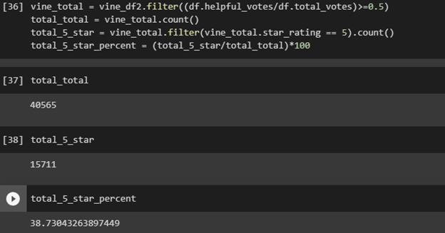

# Amazon Review Analysis

  In this module we use PySpark, as well as Amazon Web Services, to construct databases, analyze results, and draw meaningful conclusions from our data. Specifically we looked at
the Amazon Vine Program, a service offered by Amazon to have member’s review products for a small cash incentive. Using the dataset available for video game reviews, we tried to
determine if bias is introduced in reviews alongside the cash incentive. 

A link to the data used can be found [here](https://s3.amazonaws.com/amazon-reviews-pds/tsv/amazon_reviews_us_Video_Games_v1_00.tsv.gz). 

##  Results of the Analysis

We began by filtering the results down into reviews with 20 or more votes, either positive or negative, in order to ensure that we were using reviews that other Amazon customers
were interacting with. Additionally we only wanted those reviews that users found useful, so we only took reviews that users marked as helpful. Finally we split the data into
those reviews written by paid users, and those written by unpaid users.

Paid users wrote a total of 94 reviews that other users found helpful. Of those reviews, 48 were five stars, for a total of 51.063% being in that category. On the other hand,
unpaid users wrote 40,471 reviews, with 15,663 being five stars. This resulted in a total only 38.70% falling into that category.  From this analysis we can see that receiving
compensation for the review does indeed affect the reviewer’s sentiment of the overall product. 

One further thing we should consider is the impact that these paid reviews have on the overall sentiment of products. I ran a similar analysis on the dataset, although this time
we did not split the reviews into paid and unpaid, the results are as follows.

Overall 40,565 reviews were written, with 15,711 being 5 stars, or 38.73%. This is only a 0.03% bump from the unpaid percentage, indicating that although there is some bias, it
has little effect on the overall composition of the reviews as a whole. 

Further analysis should break down reviews by star rating, and determine if reviews that are interacted with most are paid or unpaid. 

